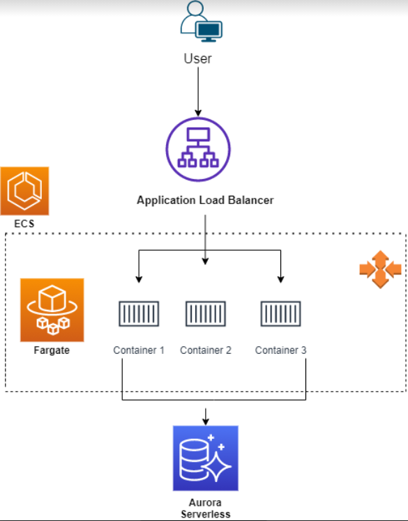

Enterprise Docker on AWS:

This architecture allows for immediate CI/CD of web applications running on Docker, ECS, and Fargate. The inspiration for this particular architecture came from a need for a highly available, scalable, and cheap deployment with minimal effort. Although the web application in this example is very simple, the use case is limitless and can be applied at an enterprise level. 

Architecture:

